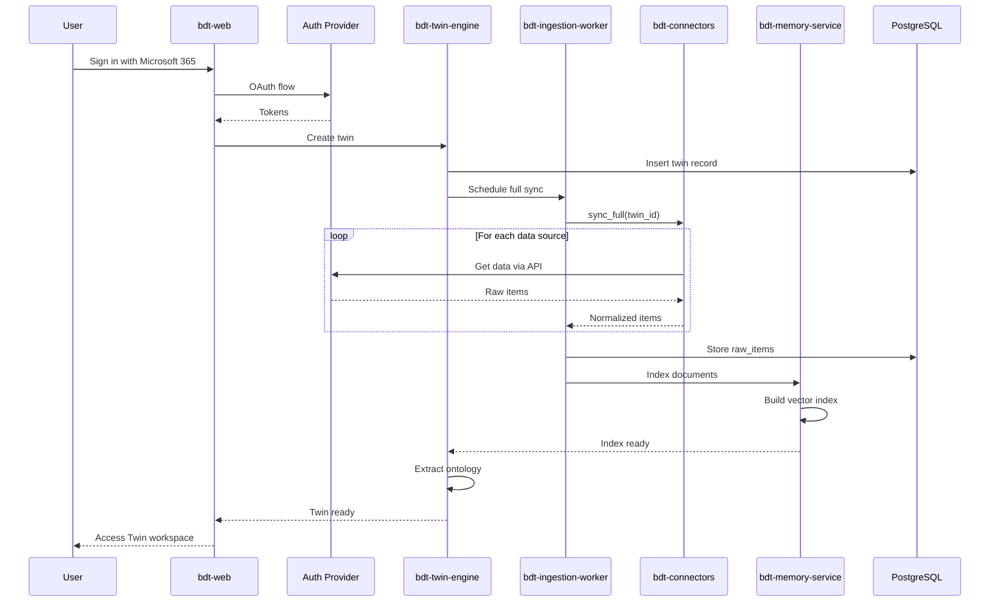
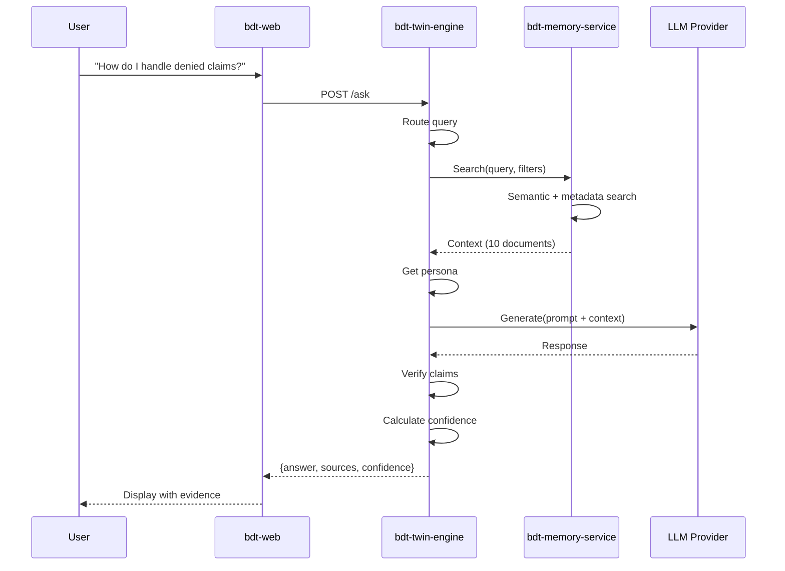

# Behavioral Digital Twin (BDT) Platform
## POV Detailed Design Document v3.0
### Production-Ready Architecture with Clear Service Boundaries

**Version:** 3.0  
**Date:** November 2024  
**Classification:** Confidential  
**Owner:** AIRIAM  
**Author:** Greg, Managing Director of Advanced Technologies  

---

## Executive Summary

The Behavioral Digital Twin (BDT) Platform builds a **read-only AI Twin** of a person from their real work data (Microsoft 365 by default, with optional Google Workspace and other systems). This v3.0 architecture provides crystal-clear service boundaries, leverages proven open-source patterns, and delivers a production-ready implementation roadmap.

### Design Philosophy

We stand on the shoulders of giants:
- **Onyx/Danswer** – Production-grade connector patterns and incremental sync strategies
- **Executive AI Assistant (EAIA)** – Practical email/calendar ingestion and agent patterns
- **LlamaIndex** – Flexible, index-centric RAG as our backbone

Our innovation is the **Behavioral Digital Twin Engine**:
- Twin ontology mapping (knowledge, processes, relationships, temporal patterns, persona & culture)
- Trust and verification layer with behavioral alignment scoring
- MCP tool integration for cross-agent interoperability

---

## 1. Five-Layer Architecture

### 1.1 Complete System Architecture

```text
┌──────────────────────────────────────────────────┐
│                 Interface Layer                  │
│                                                  │
│  • BDT Web App (Chat + Dashboards + Drilldowns)  │
│  • MCP Tools (twin.ask, twin.profile, etc.)      │
│  • 3rd-party Agents (Meeting bots, AR bots)      │
└──────────────────────▲───────────────────────────┘
                       │
                       │ REST / MCP / WebSocket
                       │
┌──────────────────────┴───────────────────────────┐
│              Twin Engine Layer                   │
│                                                  │
│  Behavioral Digital Twin Service                 │
│   • Twin Orchestrator (per-person agent)         │
│   • Query Router (RAG vs tools vs profile)       │
│   • Twin Ontology Module                         │
│       - Knowledge & Process maps                 │
│       - Relationships & Influence                │
│       - Temporal & Stress behavior               │
│       - Persona & Culture / Fourth Ontology      │
│   • Trust & Verification (confidence, guardrails)│
└──────────────────────▲───────────────────────────┘
                       │
                       │ RAG / Tool calls
                       │
┌───────────────────────┴──────────────────────────────┐
│                 RAG / Indexing Layer                 │
│                                                      │
│  LlamaIndex-based "Twin Memory Service"              │
│   • Unified document abstraction for all sources     │
│   • Chunking + embedding pipelines                   │
│   • Vector indexes (per Twin / per tenant)           │
│   • Hybrid retrieval (semantic + metadata filters)   │
│   • Query -> context packing for Twin Engine         │
└───────────────▲──────────────────────┬──────────────┘
                │                      │
     batched    │                      │ search/index ops
     ingest     │                      │
                │                      │
┌───────────────┴──────────────┐   ┌──┴────────────────────────┐
│         Storage Layer        │   │   Connector / Ingestion    │
│                              │   │          Layer             │
│  • Postgres (raw_items,      │   │                           │
│    profiles, ontology data)  │   │  "Onyx-style" Connector    │
│  • Vector DB (Pinecone /     │   │  & Ingestion Services      │
│    Qdrant / PGVector)        │   │   • Connector APIs for:    │
│  • Blob store (large files)  │   │      - Microsoft 365       │
└───────────────▲──────────────┘   │         (Graph API)        │
                │                  │      - Google Workspace    │
                │ normalized       │      - Slack, Jira, etc.   │
                │ records          │   • Schedules / jobs        │
                │                  │   • Inspired by:           │
                │                  │      - Onyx/Danswer         │
                │                  │      - EAIA Gmail/Calendar  │
                │                  └───────────▲───────────────┘
                │                              │
                │                              │ API / Webhooks
                │                              │
┌───────────────┴──────────────────────────────────────────────┐
│                         Data Sources                         │
│  • Microsoft 365: Outlook Mail, Calendar, OneDrive/SharePoint│
│  • Google: Gmail, Calendar, Drive                            │
│  • Slack, Teams, Jira, Autotask, CRM, etc. (later phases)    │
└──────────────────────────────────────────────────────────────┘
```

### 1.2 Layer Definitions

| Layer | Purpose | Key Services | Technologies |
|-------|---------|--------------|--------------|
| **Data Sources** | External systems containing work data | Microsoft 365, Google Workspace, Slack | OAuth APIs |
| **Connector/Ingestion** | Pull and normalize data | bdt-connectors, bdt-ingestion-worker | Python, Celery |
| **Storage** | Persist raw and processed data | PostgreSQL, Pinecone/Qdrant, S3 | - |
| **RAG/Indexing** | Document processing and retrieval | bdt-memory-service | LlamaIndex |
| **Twin Engine** | Behavioral intelligence and orchestration | bdt-twin-engine | LangGraph, FastAPI |
| **Interface** | User and agent interactions | bdt-web, bdt-mcp-tools | React, MCP |

---

## 2. Service Specifications

### 2.1 bdt-connectors
**Purpose:** Source-specific data connectors  
**Inspiration:** Onyx/Danswer connector patterns  
**Location:** `/bdt-connectors`

#### Key Responsibilities:
- Maintain OAuth tokens securely (encrypted at rest)
- Implement stateful sync with cursor management
- Handle rate limiting and exponential backoff
- Support full and incremental sync modes

#### Core Interface:
```python
class BaseConnector(ABC):
    """Base class inspired by Onyx/Danswer patterns"""
    
    @abstractmethod
    async def validate_credentials(self) -> bool:
        """Validate OAuth tokens are valid"""
        pass
    
    @abstractmethod
    async def sync_full(self, twin_id: str) -> SyncResult:
        """Full historical sync"""
        pass
    
    @abstractmethod
    async def sync_incremental(self, twin_id: str, since: datetime) -> SyncResult:
        """Incremental updates since timestamp"""
        pass
    
    @abstractmethod
    async def get_sync_state(self, twin_id: str) -> SyncState:
        """Get current sync cursor/state"""
        pass

class Microsoft365Connector(BaseConnector):
    """Microsoft Graph API connector"""
    
    def __init__(self, config: dict):
        self.graph_client = GraphClient(
            client_id=config['client_id'],
            client_secret=config['client_secret'],
            tenant_id=config['tenant_id']
        )
    
    async def sync_full(self, twin_id: str) -> SyncResult:
        """Pull all historical data from Microsoft 365"""
        items = []
        
        # Outlook Mail
        async for message in self.graph_client.get_all_messages():
            items.append(self.normalize_email(message))
        
        # Calendar
        async for event in self.graph_client.get_all_events():
            items.append(self.normalize_event(event))
        
        # OneDrive/SharePoint
        async for document in self.graph_client.get_all_documents():
            items.append(self.normalize_document(document))
        
        return SyncResult(items=items, cursor=datetime.utcnow())
```

### 2.2 bdt-ingestion-worker
**Purpose:** Orchestrate data ingestion jobs  
**Inspiration:** EAIA worker patterns  
**Location:** `/bdt-ingestion-worker`

#### Key Responsibilities:
- Schedule and manage ingestion jobs (one-time, periodic, continuous)
- Normalize items into standard schema
- Store in PostgreSQL `raw_items` table
- Emit events for indexing layer

#### Implementation:
```python
from celery import Celery
from datetime import datetime, timedelta

app = Celery('bdt-ingestion')

@app.task(bind=True, max_retries=3)
def run_ingestion(self, twin_id: str, mode: str, sources: list):
    """Main ingestion task with retry logic"""
    
    try:
        connector_client = ConnectorClient()
        db_client = DatabaseClient()
        memory_client = MemoryServiceClient()
        
        for source in sources:
            # Get connector for source
            connector = connector_client.get_connector(source)
            
            # Determine sync type
            if mode == "full":
                result = connector.sync_full(twin_id)
            else:
                state = db_client.get_sync_state(twin_id, source)
                result = connector.sync_incremental(twin_id, state.last_sync)
            
            # Normalize and store
            normalized_items = normalize_items(result.items, source)
            db_client.bulk_insert("raw_items", normalized_items)
            
            # Update sync state
            db_client.update_sync_state(twin_id, source, result.cursor)
            
            # Trigger indexing
            memory_client.index_documents(twin_id, normalized_items)
            
    except Exception as exc:
        # Exponential backoff retry
        raise self.retry(exc=exc, countdown=2 ** self.request.retries)

# Periodic tasks
@app.on_after_configure.connect
def setup_periodic_tasks(sender, **kwargs):
    # Run incremental sync every hour for active twins
    sender.add_periodic_task(
        3600.0,  # Every hour
        run_incremental_sync_for_active_twins.s(),
        name='Hourly incremental sync'
    )
```

### 2.3 bdt-memory-service
**Purpose:** LlamaIndex-based RAG service  
**Core Technology:** LlamaIndex  
**Location:** `/bdt-memory-service`

#### Key Responsibilities:
- Convert raw items to LlamaIndex Documents
- Manage chunking and embedding pipelines
- Maintain per-twin vector indexes
- Provide hybrid retrieval (semantic + metadata)

#### Implementation:
```python
from llama_index import (
    VectorStoreIndex,
    ServiceContext,
    Document,
    StorageContext
)
from llama_index.vector_stores import PineconeVectorStore
from llama_index.node_parser import SentenceSplitter
from llama_index.embeddings import OpenAIEmbedding

class TwinMemoryService:
    """LlamaIndex-based memory management for twins"""
    
    def __init__(self):
        # Configure embedding model
        self.embed_model = OpenAIEmbedding(
            model="text-embedding-3-large",
            dimensions=3072
        )
        
        # Configure chunking
        self.node_parser = SentenceSplitter(
            chunk_size=512,
            chunk_overlap=128
        )
        
        # Service context
        self.service_context = ServiceContext.from_defaults(
            embed_model=self.embed_model,
            node_parser=self.node_parser
        )
        
        # Vector store
        self.vector_store = PineconeVectorStore(
            api_key=PINECONE_API_KEY,
            index_name="bdt-twins",
            namespace="production"
        )
        
        # Cache of twin indexes
        self.twin_indexes = {}
    
    async def index_documents(self, twin_id: str, raw_items: list):
        """Index new documents for a twin"""
        
        # Convert to LlamaIndex Documents
        documents = []
        for item in raw_items:
            doc = Document(
                text=item['content'],
                metadata={
                    'twin_id': twin_id,
                    'source': item['source'],
                    'source_id': item['source_id'],
                    'item_type': item['item_type'],
                    'timestamp': item['metadata'].get('timestamp'),
                    'author': item['metadata'].get('author'),
                    'recipients': item['metadata'].get('recipients', [])
                }
            )
            documents.append(doc)
        
        # Get or create index for twin
        if twin_id not in self.twin_indexes:
            storage_context = StorageContext.from_defaults(
                vector_store=self.vector_store
            )
            index = VectorStoreIndex(
                [],
                service_context=self.service_context,
                storage_context=storage_context
            )
            self.twin_indexes[twin_id] = index
        else:
            index = self.twin_indexes[twin_id]
        
        # Insert documents
        index.insert_batch(documents)
        
        return len(documents)
    
    async def search(self, twin_id: str, query: str, filters: dict = None, top_k: int = 10):
        """Hybrid search with metadata filtering"""
        
        if twin_id not in self.twin_indexes:
            raise ValueError(f"No index found for twin {twin_id}")
        
        index = self.twin_indexes[twin_id]
        
        # Build metadata filters
        metadata_filters = {"twin_id": twin_id}
        if filters:
            metadata_filters.update(filters)
        
        # Create retriever with filters
        retriever = index.as_retriever(
            similarity_top_k=top_k * 2,  # Get more for reranking
            filters=metadata_filters
        )
        
        # Retrieve
        results = retriever.retrieve(query)
        
        # Rerank based on recency and relevance
        reranked = self._rerank_results(query, results, top_k)
        
        # Pack context for Twin Engine
        context = self._pack_context(reranked)
        
        return context
    
    def _rerank_results(self, query: str, results: list, top_k: int):
        """Rerank results based on relevance and recency"""
        # Implementation would use a cross-encoder or similar
        # For now, return top_k results
        return results[:top_k]
    
    def _pack_context(self, results: list):
        """Pack results into context format for Twin Engine"""
        context = []
        for result in results:
            context.append({
                'content': result.node.get_content(),
                'metadata': result.node.metadata,
                'score': result.score
            })
        return context
```

### 2.4 bdt-twin-engine
**Purpose:** Core Behavioral Digital Twin intelligence  
**Location:** `/bdt-twin-engine`

#### Key Responsibilities:
- Orchestrate twin queries (RAG + tools + profile)
- Build and maintain twin ontology
- Apply trust and verification scoring
- Expose REST and MCP APIs

#### Implementation:
```python
from fastapi import FastAPI, HTTPException
from pydantic import BaseModel
from typing import List, Dict, Optional
import asyncio

app = FastAPI(title="BDT Twin Engine")

class TwinOrchestrator:
    """Main orchestrator for twin operations"""
    
    def __init__(self, twin_id: str):
        self.twin_id = twin_id
        self.memory_client = MemoryServiceClient()
        self.llm_client = LLMClient()
        self.ontology = TwinOntology(twin_id)
        self.verifier = TrustVerifier()
    
    async def ask(self, question: str, session_id: str) -> dict:
        """Process a question to the twin"""
        
        # 1. Route query (determine if RAG, tool, or profile query)
        route = self._route_query(question)
        
        if route == "profile":
            # Direct ontology query
            return await self._handle_profile_query(question)
        
        # 2. Retrieve relevant context via RAG
        context = await self.memory_client.search(
            self.twin_id,
            question,
            filters={"session_id": session_id}
        )
        
        # 3. Get persona constraints
        persona = await self.ontology.get_persona()
        
        # 4. Build prompt
        prompt = self._build_prompt(
            question=question,
            context=context,
            persona=persona
        )
        
        # 5. Generate response
        llm_response = await self.llm_client.generate(prompt)
        
        # 6. Extract and verify claims
        claims = self._extract_claims(llm_response)
        verification = self.verifier.verify(claims, context)
        
        # 7. Build final response
        return {
            "answer": llm_response.text,
            "sources": self._format_sources(context[:5]),  # Top 5 sources
            "confidence": verification.confidence,
            "reasoning": verification.reasoning,
            "behavioral_alignment": verification.alignment_score,
            "metadata": {
                "twin_id": self.twin_id,
                "session_id": session_id,
                "route": route
            }
        }
    
    def _route_query(self, question: str) -> str:
        """Determine query type: rag, tool, or profile"""
        question_lower = question.lower()
        
        if any(keyword in question_lower for keyword in 
               ['personality', 'style', 'culture', 'how do i work']):
            return "profile"
        elif any(keyword in question_lower for keyword in 
                ['process', 'workflow', 'steps', 'procedure']):
            return "process"
        else:
            return "rag"
    
    def _build_prompt(self, question: str, context: list, persona: dict) -> str:
        """Build LLM prompt with context and constraints"""
        
        prompt = f"""You are a Behavioral Digital Twin - a read-only AI representation 
        of {self.twin_id}'s work patterns and knowledge.
        
        IMPORTANT: You are NOT the person. You are an AI analyzing their historical data.
        Always be transparent that you are AI and cannot take actions.
        
        Context from their work data:
        {self._format_context(context)}
        
        Communication style: {persona.get('communication_style')}
        Decision style: {persona.get('decision_style')}
        
        Question: {question}
        
        Provide a helpful answer based ONLY on the context provided.
        If you don't have enough information, say so clearly.
        """
        
        return prompt

class TwinOntology:
    """Manages twin behavioral ontology"""
    
    def __init__(self, twin_id: str):
        self.twin_id = twin_id
        self.db_client = DatabaseClient()
    
    async def extract_all(self):
        """Run all ontology extraction jobs"""
        
        await asyncio.gather(
            self.extract_knowledge_domains(),
            self.extract_processes(),
            self.extract_relationships(),
            self.extract_temporal_patterns(),
            self.extract_fourth_ontology()
        )
    
    async def extract_knowledge_domains(self):
        """Extract and score knowledge domains"""
        
        # Query all documents
        documents = await self.db_client.get_twin_documents(self.twin_id)
        
        # Extract domains using NLP
        domains = {}
        for doc in documents:
            extracted = self._extract_domains_from_text(doc.content)
            for domain in extracted:
                if domain not in domains:
                    domains[domain] = {
                        'count': 0,
                        'last_seen': None,
                        'unique_terms': set()
                    }
                domains[domain]['count'] += 1
                domains[domain]['last_seen'] = max(
                    domains[domain]['last_seen'] or doc.timestamp,
                    doc.timestamp
                )
        
        # Calculate depth and uniqueness
        for domain, stats in domains.items():
            depth = self._calculate_depth(stats['count'])
            uniqueness = self._calculate_uniqueness(domain, self.twin_id)
            decay = self._calculate_decay(stats['last_seen'])
            
            await self.db_client.upsert_knowledge_domain(
                twin_id=self.twin_id,
                domain=domain,
                depth=depth,
                uniqueness=uniqueness,
                decay_rate=decay
            )
    
    async def extract_processes(self):
        """Extract SOPs from behavioral patterns"""
        
        # Find recurring action sequences
        sequences = await self._find_action_sequences()
        
        for sequence in sequences:
            # Extract process details
            process = {
                'name': self._generate_process_name(sequence),
                'trigger': self._identify_trigger(sequence),
                'steps': self._extract_steps(sequence),
                'tools': self._extract_tools(sequence),
                'frequency': self._calculate_frequency(sequence),
                'confidence': self._calculate_process_confidence(sequence)
            }
            
            await self.db_client.upsert_process(
                twin_id=self.twin_id,
                **process
            )
    
    async def extract_fourth_ontology(self):
        """Map to Fourth Ontology dimensions"""
        
        dimensions = {
            'decisions': await self._analyze_decisions(),
            'power': await self._analyze_power_dynamics(),
            'fear': await self._analyze_risk_patterns(),
            'reward': await self._analyze_motivations(),
            'meaning': await self._analyze_values()
        }
        
        for dimension, analysis in dimensions.items():
            await self.db_client.upsert_fourth_ontology(
                twin_id=self.twin_id,
                dimension=dimension,
                focus=analysis['focus'],
                adjustment_params=analysis['params'],
                evidence=analysis['evidence'],
                confidence=analysis['confidence']
            )

# API Endpoints
@app.post("/v1/twins/{twin_id}/ask")
async def ask_twin(twin_id: str, request: dict):
    """Ask a question to the twin"""
    orchestrator = TwinOrchestrator(twin_id)
    response = await orchestrator.ask(
        question=request['question'],
        session_id=request.get('session_id', 'default')
    )
    return response

@app.get("/v1/twins/{twin_id}/profile")
async def get_twin_profile(twin_id: str):
    """Get complete twin profile"""
    ontology = TwinOntology(twin_id)
    
    profile = {
        'knowledge_domains': await ontology.get_knowledge_domains(),
        'processes': await ontology.get_processes(),
        'relationships': await ontology.get_relationships(),
        'temporal_patterns': await ontology.get_temporal_patterns(),
        'fourth_ontology': await ontology.get_fourth_ontology()
    }
    
    return profile
```

### 2.5 bdt-web
**Purpose:** Web interface for BDT  
**Technology:** React/Next.js  
**Location:** `/bdt-web`

#### Key Features:
```typescript
// Core application structure
const BDTApp: React.FC = () => {
  return (
    <BrowserRouter>
      <Layout>
        <Routes>
          <Route path="/" element={<Home />} />
          <Route path="/my-twin/*" element={<MyTwinWorkspace />} />
          <Route path="/team-twins/*" element={<TeamTwins />} />
          <Route path="/dashboards/*" element={<Dashboards />} />
          <Route path="/settings/*" element={<Settings />} />
        </Routes>
      </Layout>
    </BrowserRouter>
  );
};

// Twin Workspace with tabs
const MyTwinWorkspace: React.FC = () => {
  const [activeTab, setActiveTab] = useState('chat');
  const { twinId } = useAuth();
  const twin = useTwin(twinId);
  
  const tabs = [
    { id: 'chat', label: 'Chat', icon: MessageSquare },
    { id: 'overview', label: 'Overview', icon: LayoutDashboard },
    { id: 'knowledge', label: 'Knowledge', icon: Brain },
    { id: 'processes', label: 'Processes', icon: GitBranch },
    { id: 'calendar', label: 'Calendar/Triggers', icon: Calendar },
    { id: 'relationships', label: 'Relationships', icon: Users },
    { id: 'rhythm', label: 'Rhythm', icon: Clock },
    { id: 'persona', label: 'Persona & Culture', icon: User },
    { id: 'tools', label: 'Tools', icon: Wrench }
  ];
  
  return (
    <div className="flex h-full">
      <Sidebar tabs={tabs} activeTab={activeTab} onTabChange={setActiveTab} />
      <main className="flex-1">
        <TwinHeader twin={twin} />
        <TabContent>
          {activeTab === 'chat' && <ChatInterface twinId={twinId} />}
          {activeTab === 'overview' && <TwinOverview twin={twin} />}
          {activeTab === 'knowledge' && <KnowledgeDomains twin={twin} />}
          {activeTab === 'processes' && <ProcessView twin={twin} />}
          {/* ... other tabs */}
        </TabContent>
      </main>
    </div>
  );
};
```

### 2.6 bdt-mcp-tools
**Purpose:** MCP tool definitions for external agents  
**Location:** `/bdt-mcp-tools`

#### Implementation:
```python
from mcp import Tool, Parameter, Server

# Initialize MCP server
mcp_server = Server(
    name="bdt-twin-tools",
    version="1.0.0",
    description="Behavioral Digital Twin MCP Tools"
)

class TwinAskTool(Tool):
    """Query a Behavioral Digital Twin"""
    
    name = "twin.ask"
    description = "Ask a question to a person's digital twin"
    
    parameters = [
        Parameter(
            name="twin_id",
            type="string",
            description="ID of the twin to query",
            required=True
        ),
        Parameter(
            name="question",
            type="string",
            description="Question to ask the twin",
            required=True
        ),
        Parameter(
            name="context",
            type="object",
            description="Additional context for the query",
            required=False
        )
    ]
    
    async def execute(self, twin_id: str, question: str, context: dict = None):
        """Execute the tool"""
        
        # Call twin engine
        engine = TwinEngineClient()
        result = await engine.ask(
            twin_id=twin_id,
            question=question,
            session_id=context.get('session_id') if context else None
        )
        
        # Return simplified response for external agents
        return {
            "answer": result["answer"],
            "confidence": result["confidence"],
            "sources": [
                {
                    "content": s["content"][:200],  # Truncate
                    "source": s["metadata"]["source"],
                    "timestamp": s["metadata"]["timestamp"]
                }
                for s in result["sources"][:3]  # Limit to 3
            ]
        }

# Register tools
mcp_server.register_tool(TwinAskTool())
mcp_server.register_tool(TwinProfileTool())
mcp_server.register_tool(TwinProcessesTool())

# Start server
if __name__ == "__main__":
    mcp_server.start(port=8003)
```

---

## 3. Data Flow Examples

### 3.1 Complete Onboarding Flow



### 3.2 Query Processing Flow



---

## 4. Repository Structure

```
behavioral-digital-twin-platform/
├── README.md
├── docker-compose.yml
├── .env.example
├── LICENSE
├── docs/
│   ├── architecture.md
│   ├── api-reference.md
│   └── deployment.md
│
├── bdt-connectors/
│   ├── Dockerfile
│   ├── requirements.txt
│   ├── src/
│   │   ├── __init__.py
│   │   ├── base.py
│   │   ├── microsoft365.py
│   │   ├── google_workspace.py
│   │   ├── slack.py
│   │   └── api.py
│   └── tests/
│       ├── test_microsoft365.py
│       └── test_google.py
│
├── bdt-ingestion-worker/
│   ├── Dockerfile
│   ├── requirements.txt
│   ├── src/
│   │   ├── __init__.py
│   │   ├── worker.py
│   │   ├── tasks.py
│   │   ├── scheduler.py
│   │   └── normalizer.py
│   └── tests/
│       └── test_ingestion.py
│
├── bdt-memory-service/
│   ├── Dockerfile
│   ├── requirements.txt
│   ├── src/
│   │   ├── __init__.py
│   │   ├── llama_index_manager.py
│   │   ├── vector_store.py
│   │   ├── document_processor.py
│   │   └── api.py
│   └── tests/
│       └── test_memory.py
│
├── bdt-twin-engine/
│   ├── Dockerfile
│   ├── requirements.txt
│   ├── src/
│   │   ├── __init__.py
│   │   ├── orchestrator.py
│   │   ├── ontology/
│   │   │   ├── __init__.py
│   │   │   ├── knowledge.py
│   │   │   ├── processes.py
│   │   │   ├── relationships.py
│   │   │   ├── temporal.py
│   │   │   └── fourth_ontology.py
│   │   ├── verifier.py
│   │   └── api.py
│   └── tests/
│       ├── test_orchestrator.py
│       └── test_ontology.py
│
├── bdt-web/
│   ├── Dockerfile
│   ├── package.json
│   ├── next.config.js
│   ├── src/
│   │   ├── components/
│   │   │   ├── chat/
│   │   │   ├── twin/
│   │   │   └── common/
│   │   ├── pages/
│   │   ├── hooks/
│   │   ├── services/
│   │   └── styles/
│   └── public/
│
├── bdt-mcp-tools/
│   ├── requirements.txt
│   ├── src/
│   │   ├── __init__.py
│   │   ├── tools.py
│   │   └── server.py
│   └── tests/
│       └── test_tools.py
│
├── infra/
│   ├── kubernetes/
│   │   ├── deployments/
│   │   ├── services/
│   │   ├── configmaps/
│   │   └── secrets/
│   ├── terraform/
│   └── scripts/
│
└── shared/
    ├── database/
    │   ├── migrations/
    │   └── schema.sql
    └── proto/
        └── twin.proto
```

---

## 5. Technology Stack

### Core Technologies

| Component | Technology | Rationale |
|-----------|------------|-----------|
| **Backend Language** | Python 3.11+ | Best ecosystem for AI/ML |
| **API Framework** | FastAPI | Modern, async, automatic OpenAPI |
| **Task Queue** | Celery + Redis | Proven for background jobs |
| **RAG Framework** | LlamaIndex | Purpose-built for indexing |
| **Agent Framework** | LangGraph | Stateful agent orchestration |
| **Vector Database** | Pinecone/Qdrant | Managed service or self-hosted |
| **Primary Database** | PostgreSQL 15+ | JSONB support, reliability |
| **Frontend** | React + Next.js | Modern, SSR capable |
| **UI Components** | Tailwind + shadcn/ui | Rapid development |
| **Authentication** | MSAL + Google OAuth | Native integration |
| **Container Runtime** | Docker | Standard containerization |
| **Orchestration** | Kubernetes | Production scalability |

### Development Tools

```bash
# Python environment
python = "^3.11"
poetry = "^1.5"  # Dependency management

# Code quality
black = "^23.0"  # Formatting
ruff = "^0.1"   # Linting
mypy = "^1.5"   # Type checking

# Testing
pytest = "^7.4"
pytest-asyncio = "^0.21"
pytest-cov = "^4.1"

# JavaScript/TypeScript
node = "^20.0"
typescript = "^5.2"
eslint = "^8.50"
prettier = "^3.0"
```

---

## 6. Implementation Roadmap

### Phase 1: Foundation (Weeks 1-2)
- [x] Repository structure setup
- [x] Docker Compose configuration
- [ ] PostgreSQL schema implementation
- [ ] Basic authentication flow (Microsoft 365)
- [ ] Minimal viable bdt-connectors (Outlook only)

### Phase 2: Data Pipeline (Weeks 3-4)
- [ ] Complete Microsoft 365 connectors
- [ ] bdt-ingestion-worker with Celery
- [ ] Data normalization layer
- [ ] Incremental sync implementation
- [ ] Basic bdt-memory-service with LlamaIndex

### Phase 3: Intelligence Layer (Weeks 5-6)
- [ ] bdt-twin-engine orchestrator
- [ ] Basic ontology extraction (knowledge domains)
- [ ] RAG query pipeline
- [ ] Trust and verification module
- [ ] API endpoints

### Phase 4: User Interface (Weeks 7-8)
- [ ] bdt-web application scaffold
- [ ] Chat interface with evidence
- [ ] Twin overview dashboard
- [ ] Knowledge and process views
- [ ] Settings and integration management

### Phase 5: Advanced Features (Weeks 9-10)
- [ ] Complete ontology extraction (all dimensions)
- [ ] Fourth Ontology mapping
- [ ] Relationship graphs
- [ ] Temporal pattern analysis
- [ ] MCP tool integration

### Phase 6: Production Readiness (Weeks 11-12)
- [ ] Comprehensive testing (>80% coverage)
- [ ] Performance optimization
- [ ] Security audit
- [ ] Documentation completion
- [ ] Kubernetes deployment manifests
- [ ] Monitoring and observability

---

## 7. Security and Compliance

### Security Measures
- **Encryption at Rest**: AES-256-GCM for all sensitive data
- **Encryption in Transit**: TLS 1.3 minimum
- **Token Security**: OAuth tokens encrypted, short-lived, refreshable
- **Audit Logging**: All access and queries logged
- **RBAC**: Role-based access control for twin data

### Compliance Considerations
- **Data Residency**: Configurable storage regions
- **Right to Delete**: Complete twin data purge capability
- **Access Controls**: Manager approval for team twin access
- **Data Classification**: Automatic PII detection and masking
- **Retention Policies**: Configurable per data type

### Ethical Guidelines
- **Transparency**: Always labeled as AI, never impersonates
- **Read-Only**: No autonomous actions in POV
- **Consent**: Explicit opt-in for all data sources
- **Purpose Limitation**: Not used for HR decisions
- **Behavioral Boundaries**: Respects negative space patterns

---

## 8. Getting Started

### Quick Start (Development)

```bash
# Clone the repository
git clone https://github.com/airiam/behavioral-digital-twin-platform.git
cd behavioral-digital-twin-platform

# Copy environment template
cp .env.example .env
# Edit .env with your credentials

# Start core services
docker-compose up -d postgres redis

# Install Python dependencies (using Poetry)
cd bdt-twin-engine
poetry install

# Run database migrations
poetry run alembic upgrade head

# Start the twin engine
poetry run uvicorn src.api:app --reload

# In another terminal, start the web UI
cd ../bdt-web
npm install
npm run dev

# Access at http://localhost:3000
```

### Production Deployment

```bash
# Build all images
docker-compose build

# Deploy to Kubernetes
kubectl apply -f infra/kubernetes/

# Or use Helm
helm install bdt ./infra/helm/bdt-platform
```

---

## 9. Monitoring and Observability

### Key Metrics

| Service | Metric | Target | Alert Threshold |
|---------|--------|--------|-----------------|
| bdt-twin-engine | Query latency (p95) | < 2s | > 5s |
| bdt-memory-service | Index operations/sec | > 100 | < 50 |
| bdt-ingestion-worker | Items processed/hour | > 10K | < 5K |
| bdt-connectors | API success rate | > 99% | < 95% |

### Observability Stack
- **Metrics**: Prometheus + Grafana
- **Logging**: ELK Stack or Loki
- **Tracing**: OpenTelemetry + Jaeger
- **Alerting**: AlertManager + PagerDuty

---

## Document Control

**Version:** 3.0  
**Status:** Final - Ready for Implementation  
**Last Updated:** November 2024  
**Owner:** AIRIAM Advanced Technologies  
**Classification:** Confidential  

This version incorporates clear service boundaries, proven open-source patterns, and a concrete implementation roadmap. The architecture is production-ready with well-defined interfaces between services.

---

## Appendix A: Key Design Decisions

| Decision | Choice | Rationale |
|----------|--------|-----------|
| **Monorepo vs Multirepo** | Monorepo | Easier coordination during POV |
| **RAG Framework** | LlamaIndex | Purpose-built for our use case |
| **Vector Database** | Pinecone (POV), Qdrant (Prod) | Managed for POV, self-hosted for production |
| **Primary Database** | PostgreSQL | JSONB support, maturity |
| **Task Queue** | Celery | Proven at scale, good monitoring |
| **Frontend Framework** | Next.js | SSR, API routes, deployment flexibility |

## Appendix B: Inspired Patterns

### From Onyx/Danswer:
- Connector abstraction with retry logic
- Incremental sync with state tracking
- Document-agnostic indexing
- Hybrid search (semantic + keyword)

### From EAIA:
- Long-running ingestion workers
- Email/calendar specialized parsing
- Agent-based query routing
- Session-based context management

### Our Innovations:
- Twin ontology extraction
- Fourth Ontology behavioral mapping
- Negative space analysis
- Trust and verification scoring
- MCP tool exposure for cross-agent use


###Best Open-Source Projects to Leverage
1. Core RAG & Ingestion Framework
PRIMARY CHOICE: Danswer/Onyx (https://github.com/danswer-ai/danswer)
What to steal:
- Complete Microsoft 365 connector code (already production-ready!)
- Incremental sync with cursor management
- Document chunking and embedding pipeline
- Background job orchestration with Celery
- PostgreSQL schema for document storage

ALTERNATIVE: PrivateGPT (https://github.com/zylon-ai/private-gpt)
What to steal:
- Simple ingestion pipeline
- Local LLM integration patterns
- Document processing utilities
2. Microsoft 365 Integration
PRIMARY: O365-Python (https://github.com/O365/python-o365)
What to steal:
- Complete OAuth flow implementation
- Email, calendar, OneDrive API wrappers
- Token refresh handling
- Batch operations

SECONDARY: msgraph-sdk-python (https://github.com/microsoftgraph/msgraph-sdk-python)
What to steal:
- Official Microsoft Graph SDK
- Type-safe API calls
- Error handling patterns
3. Vector Database & Search
PRIMARY: ChromaDB (https://github.com/chroma-core/chroma)
What to steal:
- Embedded vector database (no separate service!)
- Simple API
- Metadata filtering
- Fast local development

ALTERNATIVE: LanceDB (https://github.com/lancedb/lancedb)
- Even simpler, file-based
- Great for POV/demo
4. Chat Interface
PRIMARY: Chainlit (https://github.com/Chainlit/chainlit)
What to steal:
- Complete chat UI out of the box
- Streaming responses
- File upload handling
- Authentication (can disable)
- 5 minutes to deploy!

ALTERNATIVE: Streamlit Chat Elements
- Even simpler but less polished
5. LLM Orchestration
PRIMARY: LangChain (https://github.com/langchain-ai/langchain)
What to steal:
- Document loaders (especially for Office files)
- Text splitters
- RAG chain templates
- Memory management

SPECIFIC: Llama-hub loaders (https://github.com/run-llama/llama-hub)
- Pre-built Microsoft 365 data loaders
- OneDrive, Outlook connectors
Ultra-Fast Implementation Plan
Data Ingestion Pipeline
# 1. Fork and setup base from Danswer
git clone https://github.com/danswer-ai/danswer.git bdt-poc
cd bdt-poc

# 2. Strip down to just Microsoft connectors
# Keep only: backend/danswer/connectors/microsoft/
# Remove: Slack, Google, Confluence, etc.

# 3. Setup simplified database
# Use their PostgreSQL schema but only these tables:
# - documents
# - document_chunks  
# - index_attempt
# - credentials
# 4. Create simplified ingestion script using O365 library
# File: ingest_microsoft.py

from O365 import Account, MSGraphProtocol
import chromadb
from datetime import datetime, timedelta

# Steal this pattern from Danswer
class MicrosoftIngestor:
    def __init__(self, client_id, client_secret, tenant_id):
        self.account = Account((client_id, client_secret), 
                              tenant_id=tenant_id)
        self.chroma = chromadb.PersistentClient(path="./bdt_vectors")
        
    def ingest_emails(self, days_back=365):
        # Copy from danswer/connectors/microsoft/outlook.py
        mailbox = self.account.mailbox()
        messages = mailbox.get_messages(limit=None, 
                                       query=f"received:>{days_back}d")
        
    def ingest_onedrive(self):
        # Copy from danswer/connectors/microsoft/onedrive.py
        drive = self.account.storage().get_default_drive()
